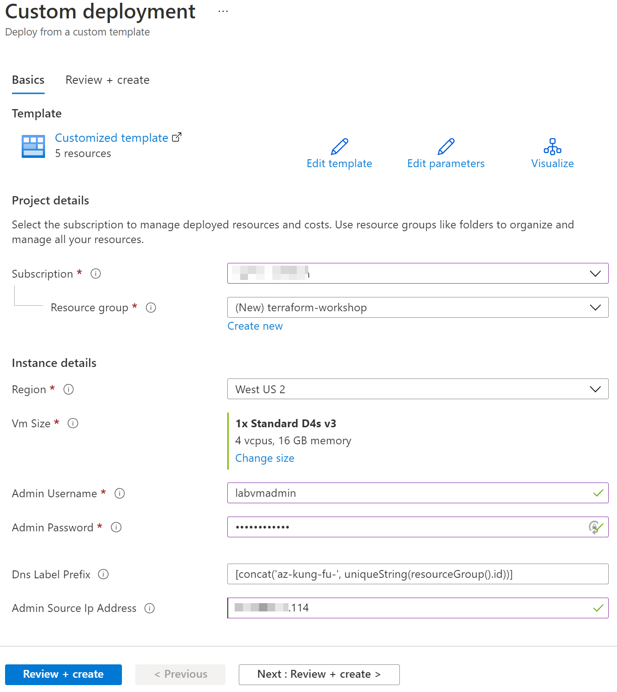
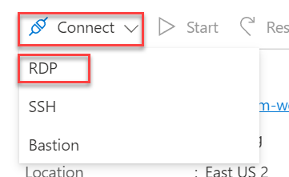
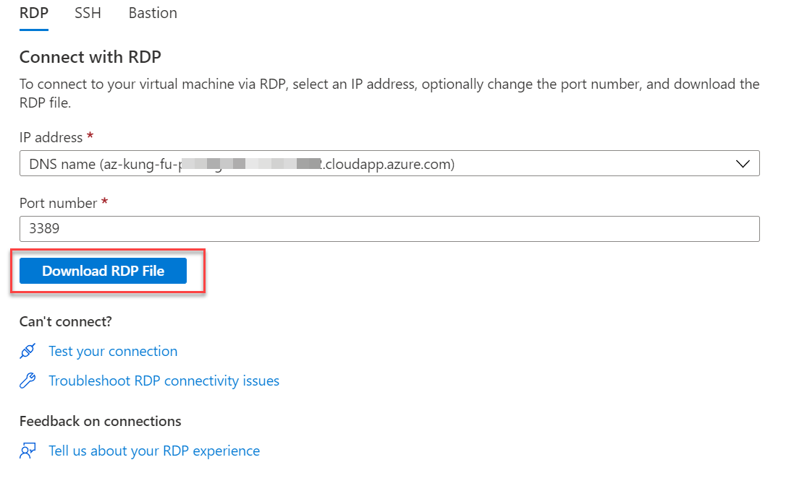

# Deploy the lab VM

- [Deploy the lab VM](#deploy-the-lab-vm)
  - [Step 1: Obtain the current IP address](#step-1-obtain-the-current-ip-address)
  - [Step 2: Deploy the ARM template](#step-2-deploy-the-arm-template)
  - [Step 3: Log into the Lab Virtual Machine](#step-3-log-into-the-lab-virtual-machine)

An [existing virtual machine ARM template](http://azkungfu.io) is available with the pre-requisites necessary to run the labs in this workshop.

## Step 1: Obtain the current IP address

1. Access [IP Chicken](https://ipchicken.com) and record the value located under the **Current IP Address** heading.

    

## Step 2: Deploy the ARM template

1. Select the `Deploy to Azure` button below to initiate the deployment of the virtual machine. Full template and scripts may be reviewed in the [build5nines/az-kung-fu-vm](https://github.com/build5nines/az-kung-fu-vm) repository on GitHub.

    

2. In the `Custom deployment` form, populate it as follows:

    | Field                   | Value                                                                             |
    | ----------------------- | --------------------------------------------------------------------------------- |
    | Subscription            | Select the desired Azure subscription                                             |
    | Resource group          | Select `Create new`, and enter `terraform-workshop`                               |
    | Region                  | Select the desired region                                                         |
    | Vm Size                 | Retain default value                                                              |
    | Admin Username          | Enter a username that is easy to type and remember, ex: `labvmadmin`              |
    | Admin Password          | Enter a **strong** password that is easy to type and remember, ex: `Pa$$w0rd1!tf` |
    | Dns Label Prefix        | Retain default value                                                              |
    | Admin Source Ip Address | Enter the IP address retrieved in **Step 1**                                      |

    

3. Wait for the lab VM to finish deploying. This deployment takes approximately 30 minutes.

## Step 3: Log into the Lab Virtual Machine

1. In the Azure portal, open the `terraform-workshop` resource group.

2. Select the `az-kung-fu-vm` Virtual machine resource.

3. From the top toolbar, expand the `Connect` item and select `RDP`.

    

4. On the `Connect with RDP` tab, select the `Download RDP File` button and download the RDP file to the desktop.

    

5. Select the RDP file on the desktop, and log into the VM with the supplied credentials in **Step 2**. If prompted regarding untrusted certificates, it is ok to proceed.

6. Once logged into the VM, **Accept** the default privacy settings, and select **No** to make this VM discoverable.

7. Open Visual Studio code, and install the Terraform extension.

Return to the [main readme](../../README.md).
