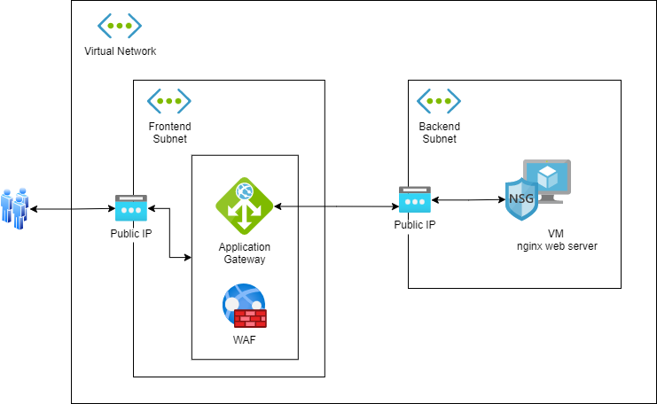

# Challenge

This exercise is meant to challenge you to use a combination of the tools you've learned today along with the documentation available for the [azurerm provider](https://registry.terraform.io/providers/hashicorp/azurerm/latest/docs) that will deploy an Azure Solution.

## Architecture

The architecture for this challenge is shown below:

## Overview

For the scenario, a Virtual Network is deployed with two subnets Frontend and Backend. In the Frontend subnet, the application gateway is deployed using the web application firewall sku, and is exposed to the internet via a public IP address. Communication to the application gateway is made over HTTP port 80. The application gateway then forwards HTTP(80) requests to the backend pool, which consists of a Linux VM with the lightweight NGINX server installed. This server is located in the Backend subnet, and is also exposed to the application gateway via a Public IP.

## SPOILERS

[Solution walkthrough](solution/walkthrough.md)

