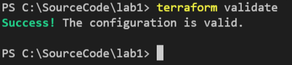

# Challenge

- [Challenge](#challenge)
  - [Lesson 1: Visual Studio Code editor experience](#lesson-1-visual-studio-code-editor-experience)
    - [Step 1: Create lab one working folder](#step-1-create-lab-one-working-folder)
    - [Step 2: Install the Terraform extension for Visual Studio Code](#step-2-install-the-terraform-extension-for-visual-studio-code)
  - [Lesson 2: Establish initial project files](#lesson-2-establish-initial-project-files)
    - [Step 1: Review initial project folder structure details](#step-1-review-initial-project-folder-structure-details)
    - [Step 2: Establish the providers.tf file](#step-2-establish-the-providerstf-file)
    - [Step 3: Establish the variables.tf file](#step-3-establish-the-variablestf-file)
    - [Step 4: Establish the main.tf file](#step-4-establish-the-maintf-file)
  - [Lesson 3: Authenticate to Azure](#lesson-3-authenticate-to-azure)
    - [Step 1: Authenticate using the Azure CLI](#step-1-authenticate-using-the-azure-cli)
  - [Lesson 4: Basic Terraform commands](#lesson-4-basic-terraform-commands)
    - [Step 1: terraform init :Initialize the Terraform project](#step-1-terraform-init-initialize-the-terraform-project)
    - [Step 2: terraform fmt :Properly format Terraform files](#step-2-terraform-fmt-properly-format-terraform-files)
    - [Step 3: terraform validate :Validate the Terraform files](#step-3-terraform-validate-validate-the-terraform-files)
    - [Step 4: terraform plan: Review the execution plan](#step-4-terraform-plan-review-the-execution-plan)
    - [Step 5: Terraform apply: Apply the configuration](#step-5-terraform-apply-apply-the-configuration)
    - [Step 6: Terraform destroy: Remove the configuration](#step-6-terraform-destroy-remove-the-configuration)
  - [Lesson 5: Define the Application Gateway architecture using IaC](#lesson-5-define-the-application-gateway-architecture-using-iac)
    - [Step 1: Create the virtual network infrastructure](#step-1-create-the-virtual-network-infrastructure)
    - [Step 2: Define the backend web server VM configuration](#step-2-define-the-backend-web-server-vm-configuration)
      - [Step 2a: Define a public IP for the backend web server VM](#step-2a-define-a-public-ip-for-the-backend-web-server-vm)
      - [Step 2b: Secure communication to the backend web server VM with a network security group](#step-2b-secure-communication-to-the-backend-web-server-vm-with-a-network-security-group)
      - [Step 2c: Define the network interface for the backend webserver](#step-2c-define-the-network-interface-for-the-backend-webserver)
      - [Step 2d: Define the backend web server virtual machine configuration](#step-2d-define-the-backend-web-server-virtual-machine-configuration)
    - [Step 3: Define the application gateway](#step-3-define-the-application-gateway)
      - [Step 3a: Obtain a public IP address for the Application Gateway](#step-3a-obtain-a-public-ip-address-for-the-application-gateway)
      - [Step 3b: Define local values to use throughout the application gateway configuration](#step-3b-define-local-values-to-use-throughout-the-application-gateway-configuration)
      - [Step 3c: Define the application gateway configuration](#step-3c-define-the-application-gateway-configuration)
  - [Lesson 6: Test the application gateway](#lesson-6-test-the-application-gateway)
    - [Step 1: Access the frontend public IP and verify it forwards to the backend webserver](#step-1-access-the-frontend-public-ip-and-verify-it-forwards-to-the-backend-webserver)
  - [Lesson 7: Introduction to Make](#lesson-7-introduction-to-make)
    - [Step 1: Create the Make file](#step-1-create-the-make-file)
    - [Step 2: Encapsulate format and validate commands](#step-2-encapsulate-format-and-validate-commands)
    - [Step 3: Create a Make command that calls another Make command](#step-3-create-a-make-command-that-calls-another-make-command)
  - [Lesson 8: Clean up](#lesson-8-clean-up)
    - [Step 1: Destroy all lab resources](#step-1-destroy-all-lab-resources)

This lab aims to get you acquainted with Terraform and Terraform commands.

The scenario of the challenge is to deploy an application gateway to Azure. An Azure Application Gateway is a web traffic load balancer. Traditional load balancers operate at the transport layer (OSI layer 4 - TCP and UDP) and route based on IP address and port. However, an Azure Application Gateway allows routing based on the HTTP request's attributes or host headers (OSI Layer 7 - application layer). For example, the Application Gateway can route URL traffic requesting `/images` to dedicated image servers and a request for `/video` to dedicated video servers [image source](https://docs.microsoft.com/en-us/azure/application-gateway/overview).


For the Lab 1 scenario, a Virtual Network contains two subnets **Frontend** and **Backend**. In the **Frontend** subnet, you will deploy an Application Gateway using the Web Application Firewall SKU. A public IP address exposes the Application Gateway to the Internet. Browsers can communicate with the Application Gateway over HTTP port 80. The application gateway then forwards HTTP(80) requests to the backend pool, consisting of a Linux VM with the lightweight NGINX server installed. This server is located in the **Backend** subnet and exposed to the application gateway via a Public IP.


## Lesson 1: Visual Studio Code editor experience

In order to develop with Terraform a text editor is required. Exercises in this lab are implemented with [Visual Studio Code](https://code.visualstudio.com/) on the [lab virtual machine](../before-the-lab/deploy-lab-vm.md).

### Step 1: Create lab one working folder

1. From the desktop of the lab VM, double-click the **Visual Studio Code** icon.

2. Close the **Get Started** tab.

3. Expand the **File** menu and select **Open Folder**.

4. In the **Open Folder** dialog, navigate to the **C:** drive and select **New folder** from the toolbar menu. Enter the name `SourceCode` for the folder name.

    

5. Continuing in the **Open Folder** dialog, double-click the **SourceCode** folder you just created. Using the **New folder** button on the toolbar, create a folder named `challenge`.

6. Continuing in the **Open Folder** dialog, select the `challenge` folder, and press the **Select Folder** button.

    

7. If prompted to trust the authors of the files in this folder, select the **Trust** checkbox and choose the **Yes, I trust the authors** button.

    

### Step 2: Install the Terraform extension for Visual Studio Code

1. From the left menu of Visual Studio Code, select the **Extensions** icon (alternatively use the hotkey shortcut: <kbd>Ctrl</kbd> + <kbd>Shift</kbd> + <kbd>x<kbd>).

2. In the **Extensions:Marketplace** search box, enter `Terraform`.

3. From the list of filtered results, find the **HashiCorp Terraform** item and select the **Install** button.

    

4. Close the **HashiCorp Terraform** extension tab, and select the **Explorer** icon from the left menu of VS Code. This selection will display the file explorer view.

    

## Lesson 2: Establish initial project files

### Step 1: Review initial project folder structure details

Split the Terraform implementation into separate files for simple projects. The file structure listed below is an example and is not prescriptive.

| File name             | Purpose                                                                                                                                                           |
| --------------------- | ----------------------------------------------------------------------------------------------------------------------------------------------------------------- |
| main.tf               | Contains the definition of the resources to be deployed and local values.                                                                                         |
| providers.tf          | Contains the provider definitions, versions, and features.                                                                                                         |
| variables.tf          | Contains the variable definitions and their default values, do not store sensitive values here                                                                    |
| variables.auto.tfvars | Set variable values described as name/value pairs. These values are read automatically and will replace the default values specified in the variables.tf file. |
| output.tf             | Contains output value definitions.                                                                                                                                |

[Make](https://makefiletutorial.com/) is a valuable tool for automating repetitive steps at the command line (among many other features) and will be used throughout the labs. This lab will make use of a **Make** file as well.

When using Git source control, leverage a **.gitignore** file. This file ensures that you do not accidentally check-in generated local files and files with potentially sensitive data. For this lab, we will skip this file. However, here is a sample **.gitignore** file as a reference.

``` text
# Local .terraform directories
**/.terraform/*

# .tfstate files
*.tfstate
*.tfstate.*

# Crash log files
crash.log
crash.*.log

# Exclude all .tfvars files, which are likely to contain sensitive data, such as
# password, private keys, and other secrets. These should not be part of version
# control as they are data points which are potentially sensitive and subject
# to change depending on the environment.
#
*.tfvars

# Ignore override files as they are usually used to override resources locally and so
# are not checked in
override.tf
override.tf.json
*_override.tf
*_override.tf.json

# Include override files you do wish to add to version control using negated pattern
#
# !example_override.tf

# Include tfplan files to ignore the plan output of command: terraform plan -out=tfplan
# example: *tfplan*

# Ignore CLI configuration files
.terraformrc
terraform.rc
```

### Step 2: Establish the providers.tf file

A [provider](https://www.terraform.io/language/providers) is a plugin in Terraform that interacts with and manages cloud resources. For example, this lab uses the [AzureRm](https://registry.terraform.io/providers/hashicorp/azurerm/latest/docs) provider to describe and manage Azure resources. Browse the [Terraform provider registry](https://registry.terraform.io/browse/providers) to review the available providers.

1. In VS Code, select the **New file** button from the **Explorer** toolbar. Next, name the new file `providers.tf`.

    

2. In the **providers.tf** file, replace the contents with the following:

    ```terraform
    terraform {
        required_providers {
            azurerm = {
            source  = "hashicorp/azurerm"
            version = "~> 3"
            }
        }
    }

    # Configure the Microsoft Azure Provider with the ability to delete non-empty resource groups
    provider "azurerm" {
        features {
            resource_group {
                prevent_deletion_if_contains_resources = false
            }
        }
    }
    ```

3. Save the **providers.tf** file.

### Step 3: Establish the variables.tf file

The **variables.tf** file contains definitions, descriptions, and default values for variables used throughout the Terraform project.

1. In VS Code, create a new file named `variables.tf`.

2. In the **variables.tf** file, define a resource group name and preferred location variable by adding the following code and saving the file:

    ```terraform
    variable "resource_group_name" {
        description = "Name of the resource group"
        type        = string
        default     = "terraform_challenge"
    }

    variable "preferred_location" {
        description = "Preferred region for deploying services"
        type        = string
        default     = "West US"
    }
    ```

### Step 4: Establish the main.tf file

The **main.tf** file holds the definitions of the resources to be deployed. To begin, this lab will define a resource group in Azure.

1. In VS Code, create a new file named `main.tf`.

2. In the **main.tf** file, define the resource group deployment with the following code and save the file:

    ```terraform
    resource "azurerm_resource_group" "challenge" {
        location = var.preferred_location
        name     = var.resource_group_name
    }
    ```

3. The anatomy of the code above is the following:

    ```terraform
    resource "resource_type" "local_name" {
        configuration_argument_setting = configuration_value
    }
    ```

4. The **AzureRM** provider contains a resource type **azurerm_resource_group** that represents a resource group in Azure. Terraform will create this group with the default values of the location and name variables located in the **variables.tf** file. The local name, **challenge**, refers to the specific instance of the resource throughout the remainder of the project, ex. **azurerm_resource_group.challenge.name** refers to the name of the resource group deployed with the local name **challenge**.

## Lesson 3: Authenticate to Azure

For Terraform to interact with the Azure cloud, it must authenticate first. While there are [multiple options available to authenticate](https://registry.terraform.io/providers/hashicorp/azurerm/latest/docs#authenticating-to-azure), this lab will make use of the [Azure CLI method](https://registry.terraform.io/providers/hashicorp/azurerm/latest/docs/guides/azure_cli).

### Step 1: Authenticate using the Azure CLI

1. In the terminal window of VS Code, execute the following command and log in with Azure credentials and follow the browser prompts. Upon successful login, feel free to close the browser window.

    ``` shell
    az login
    ```

2. Upon login, it is possible that multiple subscriptions are output in the terminal. To use a subscription that is not the default, execute the following command, replacing the `#subscription-id#` token with the desired subscription id value.

    ```shell
    az account set --subscription="#subscription-id#"
    ```

3. As an alternative to the previous step, it is also possible to set the `#subscription-id#` value in the configuration of the **azurerm** provider. If desired, open the **providers.tf** file and locate the **provider "azurerm"** block. Add the `#subscription-id#` as follows (again replacing the token with the desired subscription id value):

    ```terraform
    provider "azurerm" {
        features {
            resource_group {
                prevent_deletion_if_contains_resources = false
            }
        }

        subscription_id = "#subscription-id#"
    }
    ```

## Lesson 4: Basic Terraform commands

### Step 1: terraform init :Initialize the Terraform project

The [terraform init](https://www.terraform.io/cli/commands/init) command initializes the working directory of the Terraform project.

1. In Visual Studio Code, expand the **Terminal** menu item and select **New Terminal** (alternatively, use the hot-key combination <kbd>Ctrl</kbd> + <kbd>Shift</kbd> + <kbd>`</kbd>).

    

2. In the terminal window, execute the following command:

    ```cmd
    terraform init
    ```

3. Look for the message that Terraform has initialized successfully.

    

### Step 2: terraform fmt :Properly format Terraform files

To remain easily readable, Terraform favors standard whitespace rules. Luckily, Terraform automates the file formatting through the [terraform fmt](https://www.terraform.io/cli/commands/fmt) command.

1. In the terminal window, execute the following command to format and save the Terraform project files. This command may exit silently.

    ```cmd
    terraform fmt
    ```

### Step 3: terraform validate :Validate the Terraform files

Validate the contents of the Terraform project files by using the `[terraform validate](https://www.terraform.io/cli/commands/validate)` command.

1. In the terminal window, execute the following command to validate the Terraform project files. This command may exit silently.

    ```cmd
    terraform validate
    ```

2. Observe the output to determine if the project files are valid.

    

### Step 4: terraform plan: Review the execution plan

Review potential configuration changes Terraform plans to make using the [terraform plan](https://www.terraform.io/cli/commands/plan) command. This plan considers any existing state from previous executions (if there are any). It then proposes a set of incremental changes to achieve the current configuration. To save the plan, utilize the `-out=#file-name#`, replacing the token with the desired file name.

1. In the terminal window, execute the following to build the execution plan.

    ```cmd
    terraform plan
    ```

2. Observing the output suggests that applying the current configuration will create a new resource group in Azure.

    

### Step 5: Terraform apply: Apply the configuration

Once satisfied with the execution plan, apply the configuration into Azure using the `[terraform apply](https://www.terraform.io/cli/commands/apply)` command.

1. In the terminal window, execute the following command to apply the current configuration.

    ```cmd
    terraform apply
    ```

2. Terraform displays the execution plan and prompts for approval. When prompted to perform the actions, type `yes` and press <kbd>Enter</kbd>.

3. Terraform will now apply the configuration. First, review the output, and once completed, verify the existence of the resource group in the Azure portal (select Resource Groups and search for **terraform_challenge**).

    

    

### Step 6: Terraform destroy: Remove the configuration

To remove all objects managed by the current configuration, utilize the `[terraform destroy](https://www.terraform.io/cli/commands/destroy)` command. For example, issuing this command will delete the **terraform_challenge** resource group from Azure.

1. In the terminal window, execute the following command to destroy objects managed by the current configuration.

    ```cmd
    terraform destroy
    ```

2. Terraform displays the execution plan and prompts for approval. When prompted to perform the actions, type `yes` and press <kbd>Enter</kbd>.

    

3. Terraform will now destroy the configuration. Review the output, and once completed, verify the resource group is no longer in the Azure portal (select Resource Groups and search for **terraform_challenge**).

    

    

## Lesson 5: Define the Application Gateway architecture using IaC

### Step 1: Create the virtual network infrastructure

The application gateway scenario requires a virtual network and two subnets. The first subnet houses the backend web server. The second virtual network subnet hosts the Application Gateway, where requests are received.

1. Open `main.tf` and append the following code (documented inline).

    ```terraform
    # virtual network and associated subnets setup
    # Create virtual network
    resource "azurerm_virtual_network" "vnet" {
        name                = "vnet-"
        address_space       = ["10.0.0.0/16"]
        location            = azurerm_resource_group.challenge.location
        resource_group_name = azurerm_resource_group.challenge.name
    }

    # Create subnets
    resource "azurerm_subnet" "backend" {
        name                 = "backend"
        resource_group_name  = azurerm_resource_group.challenge.name
        virtual_network_name = azurerm_virtual_network.vnet.name
        address_prefixes     = ["10.0.1.0/24"]
    }

    resource "azurerm_subnet" "frontend" {
        name                 = "frontend"
        resource_group_name  = azurerm_resource_group.challenge.name
        virtual_network_name = azurerm_virtual_network.vnet.name
        address_prefixes     = ["10.0.2.0/24"]
    }
    ```

2. Save the file. Issue the `terraform fmt` and `terraform validate` commands.

3. Notice how the local names are used in the resource definitions to reference other established resources. As an example:

    ```terraform
    ...
        resource_group_name  = azurerm_resource_group.challenge.name
    ...
    ```

4. Issue the `terraform plan` and `terraform apply` commands to deploy the resource group and the virtual network resources. Terraform keeps track of the state; therefore, applying the configuration multiple times will skip unchanged, already deployed resources. Terraform deploys four resources: the resource group, the virtual network, and its two subnets (frontend and backend).

### Step 2: Define the backend web server VM configuration

You need a web server (or application server) to serve content. In this scenario, you will deploy a simple Linux-based virtual machine with the NGINX web server.

#### Step 2a: Define a public IP for the backend web server VM

1. To make the backend web server accessible to the Application Gateway requires a public IP address. Therefore, in `main.tf`, append the following code to define the public IP for the VM.

    ```terraform
    # Static public IP for the backend web vm
    resource "azurerm_public_ip" "publicip-vm" {
        allocation_method   = "Static"
        location            = azurerm_resource_group.challenge.location
        name                = "pip--vm"
        resource_group_name = azurerm_resource_group.challenge.name
        sku                 = "Standard"
    }
    ```

2. Save the file. Issue the `terraform fmt` and `terraform validate` commands.

3. Execute the `terraform plan` command, and notice how the plan only includes the addition of the public IP resource. Terraform does not show other resources because it tracks the state and realizes that the resource group and virtual network infrastructure configurations are already applied and unchanged.

4. Execute `terraform apply` to deploy the public IP resource for the virtual machine.

#### Step 2b: Secure communication to the backend web server VM with a network security group

 To secure communication to the backend web server virtual machine, you will deploy A network security group. This network security group contains rules to allow SSH and HTTP inbound TCP requests.

1. In `main.tf`, append the following code (documented inline):

    ```terraform
    # Network security group (NSG)
    resource "azurerm_network_security_group" "nsg" {
        name                = "nsg-backend-web"
        location            = azurerm_resource_group.challenge.location
        resource_group_name = azurerm_resource_group.challenge.name
    }

    # Allow inbound SSH communication over TCP port 22
    resource "azurerm_network_security_rule" "ssh" {
        name                        = "AllowSSH"
        priority                    = 512
        direction                   = "Inbound"
        access                      = "Allow"
        protocol                    = "Tcp"
        source_port_range           = "*"
        destination_port_range      = "22"
        source_address_prefix       = "*"
        destination_address_prefix  = "*"
        resource_group_name         = azurerm_resource_group.challenge.name
        network_security_group_name = azurerm_network_security_group.nsg.name
    }

    # Allow inbound HTTP communication over TCP port 80
    resource "azurerm_network_security_rule" "http" {
        name                        = "Allow HTTP"
        priority                    = 1024
        direction                   = "Inbound"
        access                      = "Allow"
        protocol                    = "Tcp"
        source_port_range           = "*"
        destination_port_range      = "80"
        source_address_prefix       = "*"
        destination_address_prefix  = "*"
        resource_group_name         = azurerm_resource_group.challenge.name
        network_security_group_name = azurerm_network_security_group.nsg.name
    }
    ```

2. Save the file. Issue the `terraform fmt` and `terraform validate` commands.

#### Step 2c: Define the network interface for the backend webserver

To enable communication with the backend web server, it must have a network interface (nic). The network interface is where the public IP address for the backend web server is assigned and the association of the subnet where the backend server should reside (`backend` subnet).

The virtual machine's network interface must also be associated with the network security group defined in the preceding step to allow SSH and HTTP communication.

1. Append the following code to `main.tf` to define the network interface for the backend web server virtual machine.

    ```terraform
    # Create and configure the backend web server VM network interface
    resource "azurerm_network_interface" "nic" {
        location            = azurerm_resource_group.challenge.location
        name                = "nic-backend-vm"
        resource_group_name = azurerm_resource_group.challenge.name

        ip_configuration {
            name                          = "vm-nic-config"
            private_ip_address_allocation = "Dynamic"
            public_ip_address_id          = azurerm_public_ip.publicip-vm.id
            subnet_id                     = azurerm_subnet.backend.id
        }
    }
    ```

2. Associate the network interface with the network security group (NSG) by appending the following to `main.tf`.

    ```terraform
    # Add nic to nsg
    resource "azurerm_network_interface_security_group_association" "nsg_to_nic" {
        network_interface_id      = azurerm_network_interface.nic.id
        network_security_group_id = azurerm_network_security_group.nsg.id
    }
    ```

3. Save the file. Issue the `terraform fmt` and `terraform validate` commands.

#### Step 2d: Define the backend web server virtual machine configuration

The backend web server virtual machine will deploy with an Ubuntu server image. A default admin username and password are also assigned (plankton/Password1234!). Finally, Terraform sets the network interface defined in the previous step to the virtual machine to allow SSH and HTTP communication.

1. In `main.tf`, append the following code to define the backend web server configuration.

    ```terraform
    # Create the backend web server virtual machine
    resource "azurerm_linux_virtual_machine" "vm" {
        location                        = azurerm_resource_group.challenge.location
        name                            = "backend-webserver-vm"
        network_interface_ids           = [azurerm_network_interface.nic.id]
        resource_group_name             = azurerm_resource_group.challenge.name
        size                            = "Standard_DS1_v2"
        disable_password_authentication = false
        admin_password                  = "Password1234!"
        admin_username                  = "plankton"
        computer_name                   = "backend-webserver-vm"
        custom_data                     = base64encode(file("scripts/install-nginx.sh"))

        os_disk {
            caching              = "ReadWrite"
            storage_account_type = "Premium_LRS"
            name                 = "os-backend-webserver-vm"
        }

        source_image_reference {
            offer     = "UbuntuServer"
            publisher = "Canonical"
            sku       = "16.04.0-LTS"
            version   = "latest"
        }
    }
    ```

2. Azure allows you to use a [cloud-init](https://cloudinit.readthedocs.io/en/latest/#) script in the VM definition by passing it as the **custom_data** argument on a Linux-based system. Azure will run this script on the virtual machine once deployed. This script needs to provide the installation of the NGINX web server.

3. In Visual Studio Code, create a new folder in the lab1 folder (C:\SourceCode\Lab1), name it `scripts`.

4. Create a new file called `install-nginx.sh` in the **scripts** folder, and set its contents to the following:

    ```bash
    #cloud-config
    repo_update: true
    repo_upgrade: all

    packages:
    - nginx
    ```

5. Save all modified files. Issue the `terraform fmt` and `terraform validate` commands.

### Step 3: Define the application gateway

The last item you will put in place is the application gateway resource. The application gateway must be accessible publicly because it routes requests to backend service pools. In this case,  HTTP traffic requests route to the backend web server virtual machine.

#### Step 3a: Obtain a public IP address for the Application Gateway

In the application gateway scenario, it is necessary to be able to make requests for content through the public Internet. Therefore, the Application Gateway uses a public IP address to accept browser requests and route them to the appropriate backend server.

1. In `main.tf`, append the following code to define a public IP resource that the application gateway will use.

    ```terraform
    # Static public IP for the application gateway
    resource "azurerm_public_ip" "publicip-ag" {
        allocation_method   = "Static"
        location            = azurerm_resource_group.challenge.location
        name                = "pip--ag"
        resource_group_name = azurerm_resource_group.challenge.name
        sku                 = "Standard"
    }
    ```

2. Save the file. Issue the `terraform fmt` and `terraform validate` commands.

#### Step 3b: Define local values to use throughout the application gateway configuration

In Terraform, the `locals` block allows for defining values that can be used multiple times throughout the configuration. Locals behave similarly to variables in a function.

1. In `main.tf`, define a locals block by appending the following code. For example, the following application gateway configuration uses These values.

    ```terraform
    # Define naming values for use through the application gateway configuration
    locals {
        application_gateway_name       = "agw-"
        backend_address_pool_name      = "${local.application_gateway_name}-beap"
        frontend_port_name             = "${local.application_gateway_name}-feport"
        frontend_ip_configuration_name = "${local.application_gateway_name}-feip"
        http_setting_name              = "${local.application_gateway_name}-be-htst"
        listener_name                  = "${local.application_gateway_name}-httplstn"
        request_routing_rule_name      = "${local.application_gateway_name}-rqrt"
        redirect_configuration_name    = "${local.application_gateway_name}-rdrcfg"
    }
    ```

2. Save the file. Issue the `terraform fmt` and `terraform validate` commands.

#### Step 3c: Define the application gateway configuration

The Web Application Firewall (WAF) SKU version 2 is used in this scenario. The v2 SKU offers performance and feature enhancements, including autoscaling, zone redundancy, and static virtual IPs (VIP) support. A complete list of v2 enhancements and a comparison from v1 [is available](https://docs.microsoft.com/en-us/azure/application-gateway/overview-v2).

The application gateway needs to reside in the **frontend** subnet. The Application Gateway is accessible via the public IP address defined in the previous step. The application gateway listens for HTTP requests over port 80 and forwards those requests to the backend web server virtual machine (also over HTTP protocol on TCP port 80).

The web application firewall uses the [OWASP 3.1 rule set](https://github.com/coreruleset/coreruleset/tree/v3.1/master).

1. In `main.tf`, define the application gateway by appending the following code. Notice how the configuration uses **local** values.

    ```terraform
    # Create and configure the Application Gateway
    resource "azurerm_application_gateway" "ag" {
        name                = local.application_gateway_name
        resource_group_name = azurerm_resource_group.challenge.name
        location            = azurerm_resource_group.challenge.location

        # Utilize the Web Application Firewall v2 SKU
        sku {
            name     = "WAF_v2"
            tier     = "WAF_v2"
            capacity = 2
        }

        # Assign the gateway to the frontend subnet
        gateway_ip_configuration {
            name      = "my-gateway-ip-configuration"
            subnet_id = azurerm_subnet.frontend.id
        }

        # The front_end (application gateway) port will listen on port 80
        frontend_port {
            name = local.frontend_port_name
            port = 80
        }

        # Associate the application gateway public IP
        frontend_ip_configuration {
            name                 = local.frontend_ip_configuration_name
            public_ip_address_id = azurerm_public_ip.publicip-ag.id
        }

        # The backend address pool consists of the backend web server IP address
        backend_address_pool {
            name = local.backend_address_pool_name
            ip_addresses = [
            azurerm_public_ip.publicip-vm.ip_address
            ]
        }

        # The application gateway will communicate with the backend web server using HTTP protocol over port 80
        backend_http_settings {
            name                  = local.http_setting_name
            cookie_based_affinity = "Disabled"
            path                  = "/"
            port                  = 80
            protocol              = "Http"
            request_timeout       = 60
        }

        # The application gateway will listen on the public IP for HTTP traffic
        http_listener {
            name                           = local.listener_name
            frontend_ip_configuration_name = local.frontend_ip_configuration_name
            frontend_port_name             = local.frontend_port_name
            protocol                       = "Http"
        }

        # The application gateway will route all http traffic to the backend web server
        request_routing_rule {
            name                       = local.request_routing_rule_name
            rule_type                  = "Basic"
            http_listener_name         = local.listener_name
            backend_address_pool_name  = local.backend_address_pool_name
            backend_http_settings_name = local.http_setting_name
            priority = 100
        }

        # Leverage a predefined SSL policy (TLSv1_1)
        ssl_policy {
            policy_type = "Predefined"
            policy_name = "AppGwSslPolicy20170401S"
        }

        # Configure the firewall with the OWASP 3.1 rule set
        waf_configuration {
            enabled          = true
            firewall_mode    = "Prevention"
            rule_set_type    = "OWASP"
            rule_set_version = "3.1"
        }
    }
    ```

2. Issue the `terraform fmt` command.

3. Issue the `terraform plan` command, adding an argument to output the plan to a file (**plan1.tfplan**).

    ```cmd
    terraform plan -out plan1.tfplan
    ```

4. Apply the configuration using the plan file.

    ```cmd
    terraform apply "plan1.tfplan"
    ```

## Lesson 6: Test the application gateway

Once Terraform deploys all the resources, it is time to test the application gateway.

### Step 1: Access the frontend public IP and verify it forwards to the backend webserver

1. In the Azure Portal, locate the **terraform_challenge** resource group, and open the **agw-** Application gateway resource.

    

2. On the Overview screen, note the **Frontend public IP address** (it will be different from the value highlighted in the screenshot).

   

3. Open a new browser window, and navigate to the IP address by entering the IP address into the address bar.

    

## Lesson 7: Introduction to Make

[Make](https://makefiletutorial.com/) was introduced earlier in this lab as a helpful tool for automating repetitive steps at the command line. In this lesson, learn how to leverage Make in a Terraform solution. For example, there are subsequent repetitive patterns in this lab to invoke Terraform's format and validation commands before apply throughout this lab. Make can simplify these repetitive commands into a single target.

### Step 1: Create the Make file

1. In Visual Studio Code, create a new file in the **Lab1** folder named `Makefile` (without a file extension).

### Step 2: Encapsulate format and validate commands

1. To encapsulate the `terraform fmt` and `terraform validate` commands into a single Make (**validate**) command, add the following code to the **Makefile** file.

> **Important** `make` requires indentation using tabs, not spaces.  If you see an error like this `Makefile:2: *** missing separator.  Stop.` be sure to update your `Makefile` to use tabs for indentation.

    ```make
    validate:
        terraform fmt
        terraform validate
    ```

2. Save the file.

3. In the terminal window, execute the Make command as follows. Notice how both Terraform commands execute.

    ```cmd
    make validate
    ```

    

### Step 3: Create a Make command that calls another Make command

1. Make can also call additional targets from within other command definitions. In this case, implement an **apply** command that calls the make **validate** command already residing in this file and issue the `terraform apply` command. To do this, append the following code to the **Makefile** file.

    ```make
    apply: validate
        terraform apply
    ```

2. To call other `make` commands, they must follow the colon after the command definition. If calling multiple make targets, add them to the same line, space delimited.

3. Save the file.

4. Returning to the terminal window, execute the new command. Notice all the targets contained in the `make validate` command run in addition to the `terraform apply` command.

    ```cmd
    make apply
    ```

    

## Lesson 8: Clean up

### Step 1: Destroy all lab resources

1. Congratulations on deploying the Application Gateway solution using Terraform! To delete all created resources, issue the `terraform destroy` command.
