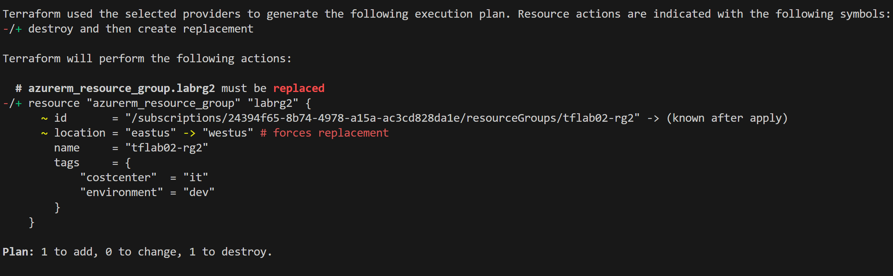

# Lab 02 - Observe the change impact of a configuration

## Create a lab folder and starter file

1. Visual Studio Code, create a new folder named `lab-02-change-impact` in the root of your terraform-workshop folder (at the same level as lab-01-hello-world).

2. Create a new file called `main.tf` in the `lab-02-change-impact` folder.

3. Copy the following code:

    ```hcl
    terraform {
        required_providers {
                azurerm = {
                source  = "hashicorp/azurerm"
                version = "3.79.0"
            }
        }
    }

    provider "azurerm" {
        # Configuration options
        features {}
    }

    resource "azurerm_resource_group" "labrg" {
        name     = "tflab02-rg"
        location = "East US"
        tags = {
            environment = "dev"
            costcenter  = "it"
        }
    }

    resource "azurerm_resource_group" "labrg2" {
        name     = "tflab02-rg2"
        location = "East US"
        tags = {
            environment = "dev"
            costcenter  = "it"
        }
    }
    ```

4. Save the file. This code will create two resource groups in Azure.

5. In the Terminal, navigate to this new folder and initialize the Terraform project.

    ```bash
    terraform init
    ```

6. Issue the fmt, validate, plan, and apply commands to create the resource groups in Azure.

7. In the Azure portal, verify the creation of the resource groups.

## Modify the region of the labrg2 resource group

1. In the `main.tf` file, change the location of the `labrg2` resource group to `West US`.

    ```hcl
        resource "azurerm_resource_group" "labrg2" {
        name     = "tflab02-rg2"
        location = "West US"
        tags = {
            environment = "dev"
            costcenter  = "it"
        }
    }
    ```

2. Save the file. Run the plan and notice how the labrg2 resource group will be destroyed and recreated in the new region.

   

## Save the plan to a file

1. Run the plan command, this time outputting the plan to a file.

    ```bash
    terraform plan -out=tfplan
    ```

2. The generated tfplan file is a binary file and not human readible.

## Apply the plan file

1. Run the apply command using the plan file.

    ```bash
    terraform apply tfplan
    ```

2. Notice how you aren't prompted to confirm the apply. This is because the plan file contains the plan and the confirmation.

3. Once completed, verify the resource group region was changed in the Azure portal.

## Remove one of the resource groups

1. In the `main.tf` file, remove the `labrg2` resource group block.

2. Save the file.

3. Run the plan command and notice how the `labrg2` resource group will be destroyed.

4. Run the apply command to destroy the `labrg2` resource group. Note how `labrg` is not affected.

## Destroy the resource groups

1. Run the destroy command to destroy the resource groups.

Congratulations, you have completed lab 2.
