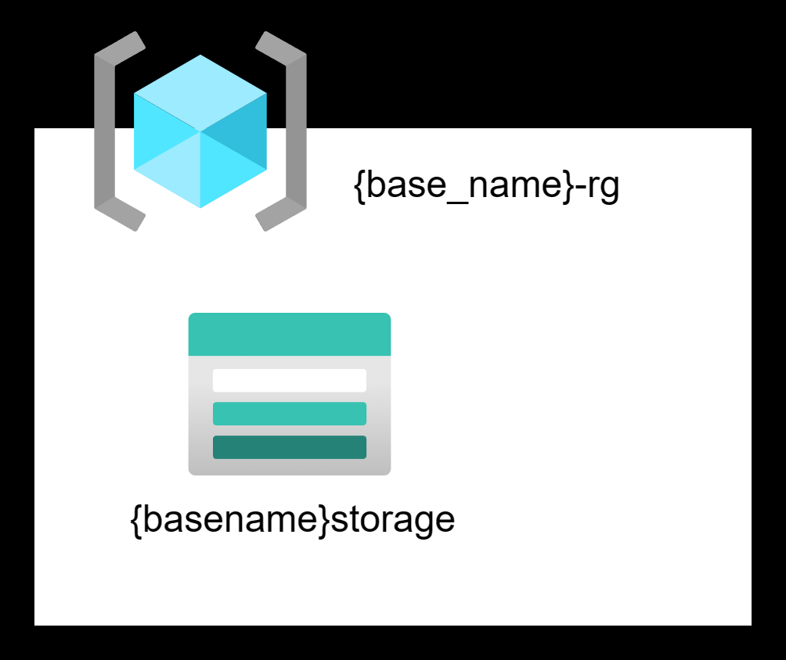
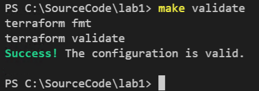
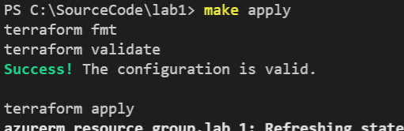
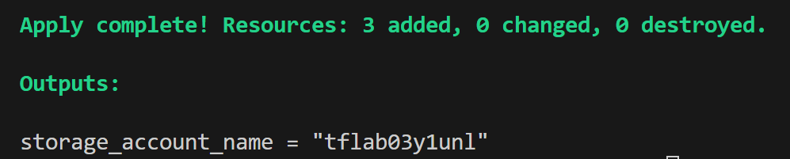

# Lab 3 - Resource references, variables, and streamlining commands with Make

## Setup the lab folder

Split the Terraform implementation into separate files for simple projects. The file structure listed below is an example and is not prescriptive.

| File name             | Purpose                                                                                                                                                           |
| --------------------- | ----------------------------------------------------------------------------------------------------------------------------------------------------------------- |
| main.tf               | Contains the definition of the resources to be deployed and local values.                                                                                         |
| providers.tf          | Contains the provider definitions, versions, and features.                                                                                                         |
| variables.tf          | Contains the variable definitions and their default values, do not store sensitive values here                                                                    |
| <anything>.tfvars | Set variable values described as name/value pairs. These values are read automatically and will replace the default values specified in the variables.tf file. |
| output.tf             | Contains output value definitions.|

When using Git source control, leverage a **.gitignore** file. This file ensures that you do not accidentally check-in generated local files and files with potentially sensitive data. For this lab, we will skip this file. However, here is a sample **.gitignore** file as a reference.

``` text
# Local .terraform directories
**/.terraform/*

# .tfstate files
*.tfstate
*.tfstate.*

# Crash log files
crash.log
crash.*.log

# Exclude all .tfvars files, which are likely to contain sensitive data, such as
# password, private keys, and other secrets. These should not be part of version
# control as they are data points which are potentially sensitive and subject
# to change depending on the environment.
#
*.tfvars

# Ignore override files as they are usually used to override resources locally and so
# are not checked in
override.tf
override.tf.json
*_override.tf
*_override.tf.json

# Include override files you do wish to add to version control using negated pattern
#
# !example_override.tf

# Include tfplan files to ignore the plan output of command: terraform plan -out=tfplan
# example: *tfplan*

# Ignore CLI configuration files
.terraformrc
terraform.rc
```

## Establish the providers.tf file

Up until now, we've had all of our code in a single main.tf file. It is recommended that you split your code into multiple files. This will make it easier to manage as your code base grows. The first file we will create is the providers.tf file. This file will contain the provider definitions, versions, and features.

1. In Visual Studio Code, create a file named `providers.tf` in the lab-03-variables folder.

2. Add the provider code to this file:

    ```hcl
    terraform {
        required_providers {
            azurerm = {
            source  = "hashicorp/azurerm"
            version = "3.79.0"
            }
        }
    }

    provider "azurerm" {
        # Configuration options
        features {}
    }
    ```

3. Save the file.

## Review the solution definition

In this lab, we're going to create a resource group and a storage account.  We want this configuration to be reusable, and as such we want to introduce variables for the base name as well as the location the resources will be deployed to.



## Establish the variables.tf file

1. In Visual Studio Code, create the file `variables.tf` in the lab-03-variables folder.

2. In this file, we will declare two string parameters, `base_name` and `location` along with default values for each. We'll also add a `tags` that will identify this deployment for governance purposes.

    ```hcl
    variable "base_name" {
        type        = string
        description = "The base name for the resources in this lab."
        default     = "tflab03"
    }

    variable "location" {
        type        = string
        description = "The Azure region where the resources in this lab will be deployed."
        default     = "East US"
    }

    variable "tags" {
        type = map(string)
        default = {
            environment = "dev"
            costcenter  = "it"
        }
    }
    ```

3. Save the file.

## Add the random provider to providers.tf

1. Storage account names must be globally unique, and as such we should introduce some type of suffix that will provide uniqueness. We'll leverage the [random provider](https://registry.terraform.io/providers/hashicorp/random/latest/docs/resources/string) to generate a random suffix that we'll append to the storage account name.

2. Open `providers.tf`, and introduce the random provider to the file. In the `terraform.required_providers` block, add the following:

    ```hcl
    random = {
        source = "hashicorp/random"
        version = "3.5.1"
    }
    ```

3. Remaining in the providers.tf file, append the following to the provider block at the end of the file:

    ```hcl
    provider "random" {
        # Configuration options
    }
    ```

4. Save the file.

## Establish the main.tf file

1. In Visual Studio Code, create the file `main.tf` in the lab-03-variables folder.

2. Declare the rules surrounding the generation of the random suffix for the storage account name. We'll generate a suffix of 5 characters in length, and we'll only use lowercase letters to satisfy the naming requirements of storage accounts.

    ```hcl
    resource "random_string" "suffix" {
        length  = 5
        special = false
        upper   = false
    }
    ```

3. Declare the storage suffix local variable. Notice how it references the random_string resource result.

    ```hcl
    locals {
        storage_suffix = random_string.suffix.result
    }
    ```

4. Declare the resource group and storage account resources.  Notice that we are using the variables we defined in the variables.tf file and the suffix is appended to the storage account name.

    ```hcl
    resource "azurerm_resource_group" "labrg" {
        name     = "${var.base_name}-rg"
        location = var.location
        tags     = var.tags
    }

    resource "azurerm_storage_account" "labstorage" {
        name                     = "${var.base_name}${local.storage_suffix}"
        resource_group_name      = azurerm_resource_group.labrg.name
        location                 = azurerm_resource_group.labrg.location
        account_tier             = "Standard"
        account_replication_type = "LRS"
        tags                     = var.tags
    }
    ```

5. Notice how the resource_group_name in the storage account references the namespace of the resource group created earlier in the file. Example: `azurerm_resource_group.labrg.name` references the name property of the resource group deployed with the local/configuration name of `labrg`.

6. Save the file.

7. Open the Terminal, and navigate to the lab-03-variables folder.

8. Initialize the Terraform project.

    ```bash
    terraform init
    ```

9. Issue the fmt, validate and plan commands, and review the output.

## Streamlining commands with Make

You've probably noticed that we are issuing a lot of the same commands over and over again.  We can streamline this process by using a Makefile and [Make](https://makefiletutorial.com/).  A Makefile is a simple text file that contains a set of commands that can be executed from the command-line.  We can use this to streamline our Terraform commands.

1. In Visual Studio Code, create a file named `Makefile` in the lab-03-variables folder (there is no extension to this file).

2. To encapsulate the `terraform fmt` and `terraform validate` commands into a single Make (**validate**) command, add the following code to the **Makefile** file.

    > **Important** `make` requires indentation using tabs, not spaces.  If you see an error like this `Makefile:2: *** missing separator.  Stop.` be sure to update your `Makefile` to use tabs for indentation.

    ```make
    validate:
        terraform fmt
        terraform validate
    ```

3. Save the file.

4. In the terminal window, execute the Make command as follows. Notice how both Terraform commands execute.

    ```cmd
    make validate
    ```

    

## Create a Make command that calls another Make command

1. Make can also call additional targets from within other command definitions. In this case, implement an **apply** command that calls the make **validate** command already residing in this file and issue the `terraform apply` command. To do this, append the following code to the **Makefile** file. Note that we've added the `-auto-approve` flag to the `terraform apply` command to automatically approve the plan, proceed with caution with this command!

    ```make
    apply: validate
        terraform apply -auto-approve
    ```

2. To call other `make` commands, they must follow the colon after the command definition. If calling multiple make targets, add them to the same line, space delimited.

3. Save the file.

4. Returning to the terminal window, execute the new command. Notice all the targets contained in the `make validate` command run in addition to the `terraform apply` command.

    ```cmd
    make apply
    ```

    

5. Once the apply has completed, use the Azure portal to review the deployed resources. Notice the default values for the variables are used, and the random suffix is added to the storage account name.

6. In the terminal window, execute the `terraform destroy` command to remove the deployed resources. We'll start with a clean slate in the next section.

## Create an output variable for the storage account name

It would be nice to be able to see the generated storage account name after the deployment without having to access the Azure Portal (or paying close attention to the console output while the apply is running).  We can do this by creating an output variable.

1. In Visual Studio Code, create the file `output.tf` in the lab-03-variables folder.

2. Add the following code to the file:

    ```hcl
    output "storage_account_name" {
        value = azurerm_storage_account.labstorage.name
    }
    ```

3. Save the file.

4. In the terminal window, execute the `make apply` command to deploy the resources.

5. Once complete, the output will display the storage account name.

    

## Override the default values for the variables

When we applied the configuration, Terraform was using the default values for the variables.  We can override these values by using a `*.tfvars` file.  Files with this extension are automatically loaded by Terraform and will override the default values.

1. In Visual Studio Code, create the file `terraform.tfvars` in the lab-03-variables folder.

2. Add the following code to the file:

    ```hcl
    location = "West US"
    ```

3. Save the file.

4. In the terminal window, execute the `make validate` command to validate the files.

5. In the terminal window, execute the `terraform plan` command to view the planned changes. Notice how the resources are to be destroyed and recreated in the new location. (Do not apply these changes).  In the `terraform.tfvars`, switch the location back to `East US`.

6. Alternatively, you can send in variable values through the command-line. Execute the following command to override the location variable. Notice the same plan comes up to destroy and recreate the resources in the new region. (Do not apply these changes).

    ```cmd
    terraform plan -var="location=West US"
    ```

    >**Note**: command-line variables will take precedence over the `*.tfvars` file.

7. In the terminal window, execute the `terraform destroy` command to remove the deployed resources.

## Sensitive values

Connection strings, access keys, and passwords are all values that are considered sensitive and should be redacted from any output to the console. In this exercise, we'll attempt to retrieve the connection string of the storage account.

1. In the terminal window, access the Terraform console by executing the following command:

    ```cmd
    terraform console
    ```

2. In the Terraform console, execute the following command to retrieve the connection string of the storage account:

    ```cmd
    azurerm_storage_account.labstorage.primary_connection_string
    ```

3. The output of this command will indicate the value is sensitive and will not be displayed.  Exit the Terraform console by executing the following command:

    ```cmd
    exit
    ```

4. Open the `terraform.tfstate` file. Notice that the connection string is available in this file. Using Terraform Cloud or Terraform Enteprise (paid) will allow you to store the state and encrypt sensitive values in a secure location.

## Creating a sensitive variable

We'll create a `database_password` and mark it as a sensitive variable.

1. In Visual Studio Code, open the `variables.tf` file.

2. Append the following code to the file:

    ```hcl
    variable "database_password" {
        type        = string
        description = "The password for the database."
        sensitive   = true
    }
    ```

3. Save the file.

4. Run `make validate` to format and validate the files.

5. Run `terraform plan`. Notice how you are prompted for the value of the `database_password` variable. Enter any value and press enter.

6. You can provide sensitive values by using a *.tfvars file (many organizations use a secrets.tfvars file) or override it from the command-line.

7. Execute `terraform destroy` to clean up the resources.

Congratulations, you've completed lab 3.
