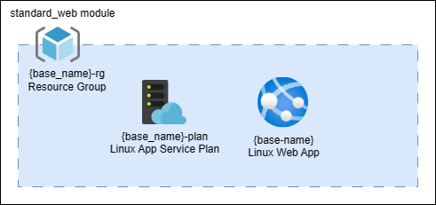

# Lab 4 - Modules

In this lab, we'll work to create a reusable module that reflects the default/standard configuration of a Linux-based web application at our company. In this lab, we'll create the module in a local folder. Keep in mind however that the module can be stored in a remote location, such as a GitHub repository, and referenced from there for reuse.

## Module architecture



The standard deployment consists of a resource group, an application service plan, and a web application resource.

## Establish the providers file for the root workspace

1. In Visual Studio Code, create a new directory for this lab, `lab-04-modules`.

2. Create the `providers.tf` file and add the following code to it. It is important to note here that modules inherit the calling project's providers. In this case, the root workspace will be calling the module, so the providers must be defined in the root workspace.

    ```hcl
    terraform {
        required_providers {
            azurerm = {
                source  = "hashicorp/azurerm"
                version = "3.79.0"
            }
            random = {
                source  = "hashicorp/random"
                version = "3.5.1"
            }
        }
    }

    provider "azurerm" {
        # Configuration options
        features {}
    }

    provider "random" {
        # Configuration options
    }
    ```

3. Save the file.

## Create the module

A module should contain not only the configuration of the resources, it should also include documentation via a `README.md` and `LICENSE` file. As you are creating the files for this module, you are responsible for reviewing and understanding the content within. If at any time you have any questions, please reach out to your instructor.

1. Create a new directory named `modules` in the root of the project (in the same directory as the `providers.tf` file).

2. Create a new directory named `standard_web` in the `modules` directory.

3. In the `standard_web` folder, create the `variables.tf` file with the following content, then save this file.

   ```hcl
   variable "base_name" {
        type        = string
        description = "The base name for the resources in this lab."
        default     = "tflab04"

        validation {
            condition     = can(regex("^([a-z][a-z0-9]{2,9})$", var.base_name))
            error_message = "The base name must be all lower case, no symbols or special characters, be between 3 and 10 characters long, and cannot start with a number."
        }
    }

    variable "location" {
        type        = string
        description = "The Azure region where the resources in this lab will be deployed."
        default     = "East US"

        validation {
            condition     = contains(["East US", "East US 2", "West US"], var.location)
            error_message = "Valid values are East US, East US 2, or West US."
        }
    }

    variable "tags" {
        type = map(string)
        default = {
            environment = "dev"
            costcenter  = "it"
        }
    }
    ```

4. In the `standard_web` folder, create a `README.md` file with the following content:

    ```md
    # Standard Linux Web Deployment Module for Company ABC

    This module provides a standardized way to deploy application level constructs. This includes an Azure storage account, application service plan, and Azure Web App Service.

    ## Usage
   
    module "standard_web" {  
        source = "github.com/company-abc/terraform-azure-standard-web"  
    
        base_name = "applicationname"  
        location  = "East US"  
        
        tags = {  
            environment = "prod"  
            costcenter  = "it"  
        }  
    }    

    ## Variables

    This module has the following input variables:

    1. base_name: The base name for the resources in this lab.
    2. location: The Azure region where the resources in this lab will be deployed.
    3. tags: A map of tags to apply to the resources.

    ## Validation

    This module uses validation blocks to ensure that the input variables have valid values:

    1. The base_name variable must be all lowercase, no symbols or special characters, be between 3 and 10 characters long, and cannot start with a number.
    2. The location variable must be one of "East US", "East US 2", or "West US".

    ## Authors

    This module is written and maintained by Company ABc. Please feel free to reach out with any questions or issues.

    ## License

    This module is licensed under the MIT License. See the LICENSE file for details.

    ```

5. In the same folder, create the `LICENSE` file:

    ```text
    MIT License  
  
    Copyright (c) 2023 Company ABC  
    
    Permission is hereby granted, free of charge, to any person obtaining a copy of this software and associated documentation files (the "Software"), to deal in the Software without restriction, including without limitation the rights to use, copy, modify, merge, publish, distribute, sublicense, and/or sell copies of the Software, and to permit persons to whom the Software is furnished to do so, subject to the following conditions:  
    
    The above copyright notice and this permission notice shall be included in all copies or substantial portions of the Software.  
    
    THE SOFTWARE IS PROVIDED "AS IS", WITHOUT WARRANTY OF ANY KIND, EXPRESS OR IMPLIED, INCLUDING BUT NOT LIMITED TO THE WARRANTIES OF MERCHANTABILITY, FITNESS FOR A PARTICULAR PURPOSE AND NONINFRINGEMENT. IN NO EVENT SHALL THE AUTHORS OR COPYRIGHT HOLDERS BE LIABLE FOR ANY CLAIM, DAMAGES OR OTHER LIABILITY, WHETHER IN AN ACTION OF CONTRACT, TORT OR OTHERWISE, ARISING FROM, OUT OF OR IN CONNECTION WITH THE SOFTWARE OR THE USE OR OTHER DEALINGS IN THE SOFTWARE.
    ```

6. Up until now, we've been putting all of our resources in the `main.tf` file. This isn't a requirement. To help with readability in larger projects, you can include various types of resources in their own files. As long as the file extension is `*.tf`, Terraform will pick it up.

7. In the `standard_web` folder, create a `main.tf` file with the following content - this will create the resource group:

    ```hcl
    resource "azurerm_resource_group" "labrg" {
        name     = "${var.base_name}-rg"
        location = var.location
        tags     = var.tags
    }
    ```

8. In the `standard_web` folder, create a `storage.tf` file with the following content - this will create the storage account:

    ```hcl
    resource "random_string" "suffix" {
        length  = 5
        special = false
        upper   = false
    }

    locals {
        storage_suffix = random_string.suffix.result
    }

    resource "azurerm_storage_account" "labstorage" {
        name                     = "${var.base_name}${local.storage_suffix}"
        resource_group_name      = azurerm_resource_group.labrg.name
        location                 = azurerm_resource_group.labrg.location
        account_tier             = "Standard"
        account_replication_type = "LRS"
        tags                     = var.tags
    }
    ```

9. In the `standard_web` folder, create a `app_service.tf` file with the following content - this will create the application service plan and web application:

    ```hcl
    resource "azurerm_service_plan" "appsvc" {
        name                = "${var.base_name}-plan"
        location            = azurerm_resource_group.labrg.location
        resource_group_name = azurerm_resource_group.labrg.name
        os_type             = "Linux"
        sku_name            = "B1"
        tags                = var.tags
    }

    resource "azurerm_linux_web_app" "appsvc" {
        name                = var.base_name
        location            = azurerm_resource_group.labrg.location
        resource_group_name = azurerm_resource_group.labrg.name
        service_plan_id     = azurerm_service_plan.appsvc.id
        https_only          = true
        site_config {
            minimum_tls_version = "1.2"
        }
        tags                = var.tags
    }
    ```

10. Let's now create the `output.tf` file so that we can later demonstrate how to see module output:

    ```hcl
    output "linux_hostname" {
        value = azurerm_linux_web_app.appsvc.default_hostname
        description = "Default host name of the Linux application"
    }
    ```

11. Ensure all the files are saved.

## Consume the custom module in the root workspace

Earlier in the root project, we have already defined the `providers.tf` file. Now we'll finish up setting up the root workspace, then we'll use the module we just created.

1. In the root of the project, create a `main.tf` file with the following content and save the file:

    ```hcl
    module "abc_standard_web" {
        source    = "./modules/standard_web"
        base_name = "live360tf"
    }
    ```

2. The code in `main.tf` will load the module we just created from the local file system. The source is the path to where to find the module code. This source could also be a network drive, a GitHub repository, or any other location that Terraform can access. Read the documentation to find other options for [module sources](https://developer.hashicorp.com/terraform/language/modules/sources) to consume reusable modules (whether you've created them or someone else).

3. In the root project, create an `output.tf` file with the following content that will output the hostname of the web application from the module. Notice how the value is prefixed with `module`. If you did not declare this output in the root project, you would not be able to see the output from the consumed module as they are not output to the console. Only the root module outputs are displayed.

    ```hcl
    output "module_linux_hostname" {
        value = module.abc_standard_web.linux_hostname
        description = "Default host name of the Linux application"
    }
    ```

4. Ensure all files are saved.

5. In the terminal, run `terraform init` to initialize the project. Note that if you adding a custom module or new provider at any point in the lifecycle of your project, you must re-run `terraform init` to ensure that the new module or provider is downloaded and available for use.

6. Run the gamut of Terraform commands: fmt, validate, plan, apply. See how you are able to see the output from the module in the console.

7. Run `terraform destroy` to remove the resources.

Congratulations, you've completed lab 4 !
