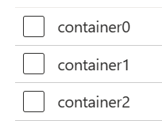
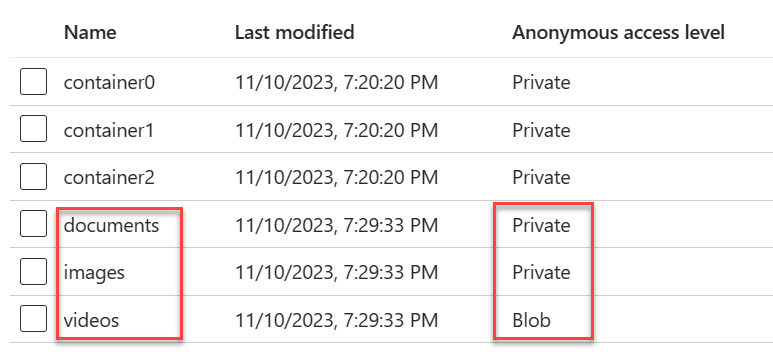
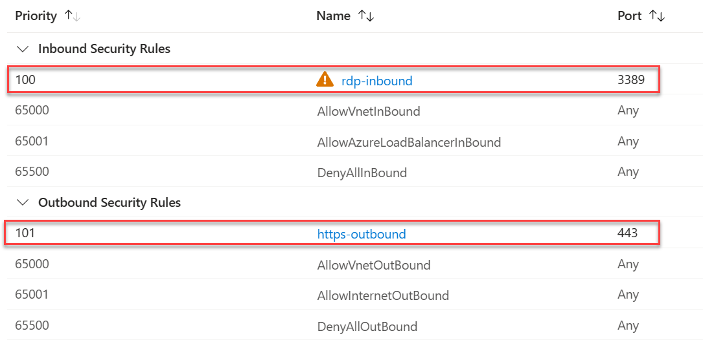

# Lab 5 - Control structures

In this lab, we'll only create a `main.tf` file for all the exercises in this lab.

## Create a lab folder

1. In Visual Studio Code, create the folder **lab-05-control-structures**.

2. In this file, create a `main.tf` file. Initilize this code with the following code listing:

    ```hcl
    terraform {
        required_providers {
                azurerm = {
                source  = "hashicorp/azurerm"
                version = "3.79.0"
            }
        }
    }

    provider "azurerm" {
        # Configuration options
        features {}
    }
    ```

## Create a lab resource group in the Azure Portal

In this step, create a resource group that will act as an already existing resource group. We'll use a data source to pull information about this resource into our configuration.

Remember, using a data source means we're tapping into an existing resource not managed by our current configuration. Data sources are commonly used when infrastructure is shared across multiple projects.

1. In the Azure Portal, create a new resource group named `lab-05-rg`.

## Retrieve existing resource group data using a datasource

1. In order to use existing resources within a configuration, you will use a data source. Create a data source that pulls in information about the `lab-05-rg` by appending the following to the `main.tf` file.

    ```hcl
    data "azurerm_resource_group" "lab05-rg" {
        name = "lab-05-rg"
    }
    ```

2. This code utilizes a datasource to retrieve the resource group with the name of `lab-05-rg`. The resource namespace in configuration has no impact on the retrieval of the resource details. It is important that the name matches exactly the resource deployed in Azure.

3. Create an output variable to determine if the resource group details are retrieved properly. Append the following code to `main.tf`. Notice how the output value is prefixed with `data`; this is required when working with data sources.

    ```hcl
    output "lab05-rg-location" {
        value = data.azurerm_resource_group.lab05-rg.location
    }
    ```

4. Run through the terraform commands: init, fmt, validate, plan, and apply.

5. Notice the output variable prints to the console with the proper value.

## Use count to create multiple storage account containers

In order to reduce code, Terraform has a few constructs that will allow for the creation of multiple resources with similar configuration. The first one we'll approach is count.

1. In `main.tf` add the following code to create a storage account:

    ```hcl
    resource "random_string" "suffix" {
        length  = 5
        special = false
        upper   = false
    }

    locals {
        storage_suffix = random_string.suffix.result
    }

    resource "azurerm_storage_account" "storage" {
        name                     = "lab05storage${local.storage_suffix}"
        resource_group_name      = data.azurerm_resource_group.lab05-rg.name
        location                 = data.azurerm_resource_group.lab05-rg.location
        account_tier             = "Standard"
        account_replication_type = "LRS"
    }
    ```
2. Notice how the resource group name and location are referencing the data source resource group.

3. Add the following code to create three containers within the storage container. Notice the **count** attribute sets the instance count to `3`, and that the names of the container remain unique by appending the `count.index` value. This index is zero-based.

    ```hcl
    resource "azurerm_storage_container" "storage" {
        count                 = 3
        name                  = "container${count.index}"
        storage_account_name  = azurerm_storage_account.storage.name
        container_access_type = "private"
    }
    ```

4. Apply the configuration changes.

5. Once deployed, visit the Azure Portal, locate the storage account and verify three containers (indexed 0 through 2) exist.

    

## Use for_each to create multiple containers in the storage account

The next control structure we'll visit is similar to count, however instead of iterating over numeric indexes, it iterates through key/value pairs.

1. Define the container key/value collection. In this case we'll use the key to house the name of the container, and the value to indicate the privacy level of the container. In this case we will be creating three containers named images, videos, and documents. Append the following code to `main.tf` to declare the local variable containing the container information.

    ```hcl
    locals {
        containers = {
            images    = "private"
            videos    = "blob"
            documents = "private"
        }
    }
    ```

2. Create the containers using the **for_each** attribute that will loop through the containers local variable setting the name of the container to the key, and the privacy level to the value. Note the key and value are prefixed with **each**, this is required.

    ```hcl
    resource "azurerm_storage_container" "storage_foreach" {
        for_each              = local.containers
        name                  = each.key
        storage_account_name  = azurerm_storage_account.storage.name
        container_access_type = each.value
    }
    ```

3. Apply the changes.

4. Once deployment is complete, revisit the storage container and verify the images, videos, and documents folders exist.

    

## Create multiple sub-resources using a Dynamic Block

Dynamic blocks are used to create multiple sub-resources that are contained within a parent resource. In this case, we'll be defining the security rules in a network security group. While this example may not look like it's accomplishing much, think about how much cleaner it will be if you were instantiating 10 or 20 rules.

1. Create a network security group and loop via a dynamic block and for_each loop.

    ```hcl
    resource "azurerm_network_security_group" "network" {
        name                = "lab05-nsg"
        location            = data.azurerm_resource_group.lab05-rg.location
        resource_group_name = data.azurerm_resource_group.lab05-rg.name


        dynamic "security_rule" {
            for_each = {
                rdp = {
                    name      = "rdp-inbound"
                    direction = "Inbound"
                    priority  = 100
                    port      = 3389
                },
                http = {
                    name      = "https-outbound"
                    direction = "Outbound"
                    priority  = 101
                    port      = 443
                }
            }
            content {
            name                       = security_rule.value["name"]
            priority                   = security_rule.value["priority"]
            direction                  = security_rule.value["direction"]
            access                     = "Allow"
            protocol                   = "Tcp"
            source_address_prefix      = "*"
            destination_address_prefix = "*"
            source_port_range          = "*"
            destination_port_range     = security_rule.value["port"]
            }
        }
    }
    ```

2. Notice how the dynamic block has a **for_each** attribute and a **content** attribute. The elements iterated through the for_each are applied to the content block. We could also have used the **key** in this case for the naming using the syntax `security_rule.key`. The security rule collection could have also been declared as a local variable.

3. Apply the configuration changes.

4. Verify the network security group resource that is deployed has the defined inbound and outbound security rules.

    

5. Issue a `terraform destroy` to clean up the resources created.

6. Once the destroy has completed, notice how the `lab-05-rg` remains, this is because it was not part of our configuration. Delete this resource group manually.


## Investigate some built-in functions using the Terraform Console.

Terraform has many built-in functions that can be used in your configuration files. We've seen some of these in previous exercises, but let's take a look at a few more. Find full documentation on the [Terraform website](https://www.terraform.io/docs/configuration/functions.html). While we are using the Terraform Console for this exercise, these functions are valid for use in any of your configuration files.

1. Open the Terraform Console by issuing the `terraform console` command.

2. Find the length of a string by issuing the following command:

    ```hcl
    length("Hello World")    
    ```

3. Make a string lower case by issuing the following command:

    ```hcl
    lower("Hello World")
    ```

4. Flatten multiple lists into a single list by issuing the following command:

    ```hcl
    flatten(["Hello", "World"], ["Goodbye", "World"])
    ```

5. Return distinct values in a list by issuing the following command:

    ```hcl
    distinct(["Hello", "World", "Hello"])
    ```

6. Join a list of strings into a comma-delimited single string by issuing the following command:

    ```hcl
    join(",", ["Hello", "World"])
    ```

7. Create a UUID by issuing the following command:

    ```hcl
    uuid()
    ```

8. Encrypt a string using bcrypt by issuing the following command:

    ```hcl
    bcrypt("Hello World")
    ```

9. Base64 encode a string by issuing the following command:

    ```hcl
    base64encode("Hello World")
    ```

10. Feel free to expriment more with the built-in functions from the documentation. The Terraform Console is a great tool to try things out before committing them into configuration files.

11. Exit the Terraform Console by issuing the `exit` command.

Congratulations! You've completed the lab 5!
