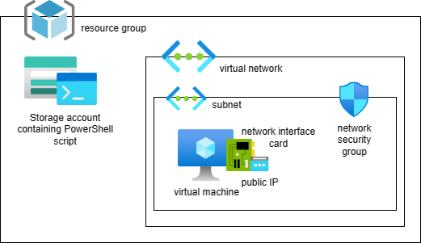
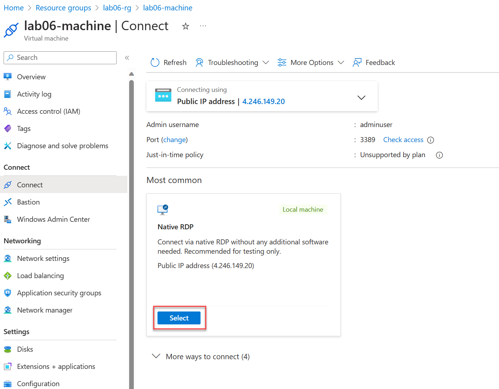
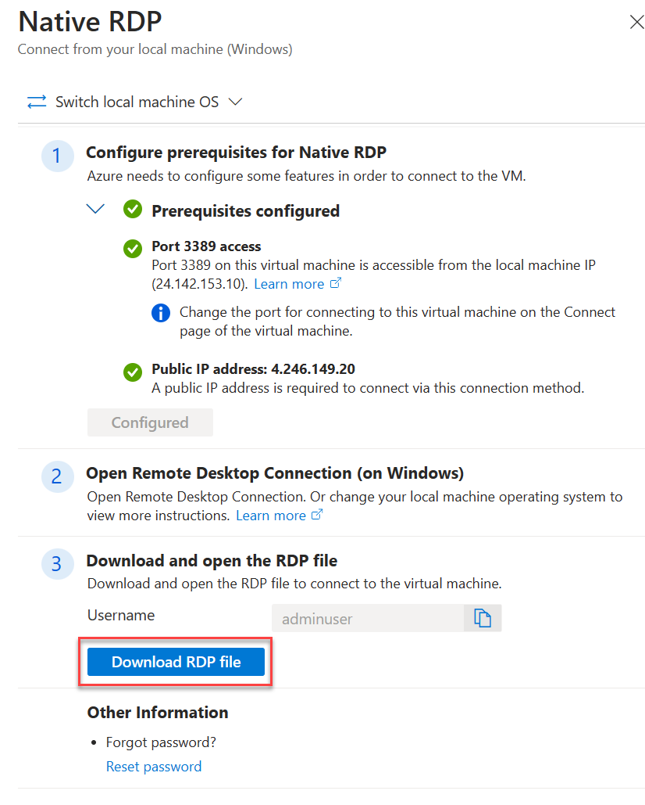
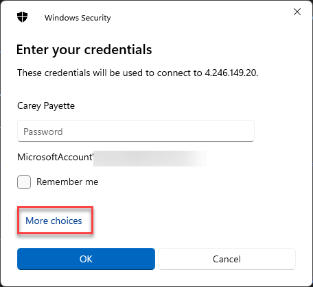
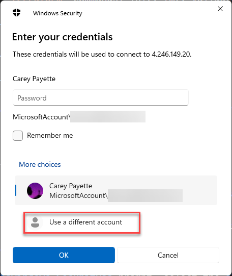
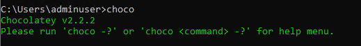
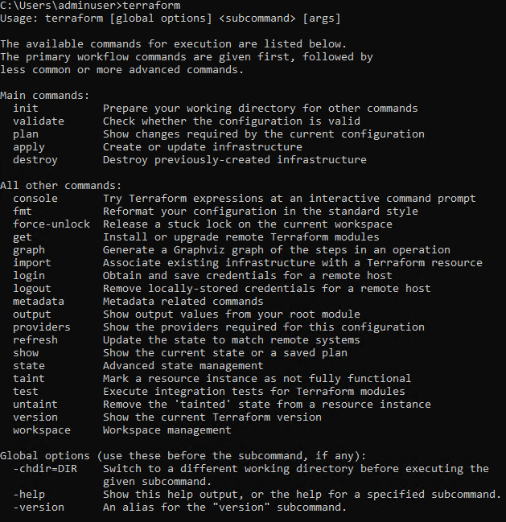
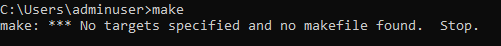

# Lab 6 - Running scripts on virtual machines

Many cloud migration solutions include having to run custom software configurations on virtual machines. These can include web servers, like NGINX, or tooling such as Terraform and Make for a lab class. In this lab, we'll deploy a virtual machine, and run a PowerShell script on it to install the Chocolatey package manager, and then use Chocolatey to install both Terraform and Make.

## Lab architecture



## Create lab workspace

All configuration code is provided, it is up to you to read through each code listing to understand what it is doing. If you have any questions regarding the configuration code, please ask your instructor.

1. In Visual Studio Code, create the folder `lab-06-running-scripts-on-vms` in the root of your repository.

2. Create the `providers.tf` file:

    ```hcl
    terraform {
        required_providers {
            azurerm = {
            source  = "hashicorp/azurerm"
            version = "3.79.0"
            }
            random = {
            source  = "hashicorp/random"
            version = "3.5.1"
            }
        }
    }

    provider "azurerm" {
        # Configuration options
        features {}
    }

    provider "random" {
        # Configuration options
    }
    ```

3. Create the `main.tf` file:

    ```hcl
    resource "azurerm_resource_group" "labrg" {
        name     = "lab06-rg"
        location = "East US"
    }
    ```

4. Create the PowerShell script, `install_stuff.ps1` - this script is responsible for installing the Chocolatey package manager, and then using Chocolatey to install Terraform and Make. The script listing is as follows:

    ```powershell
    # Enforce TLS
    [Net.ServicePointManager]::SecurityProtocol = [Net.SecurityProtocolType]::Tls12  

    # Set execution policy
    Set-ExecutionPolicy -ExecutionPolicy Bypass -Scope LocalMachine  

    # Install Chocolatey  
    iex ((New-Object System.Net.WebClient).DownloadString('https://chocolatey.org/install.ps1'))  
    
    # Install Terraform using Chocolatey  
    choco install terraform -y  
    
    # Install Make using Chocolatey  
    choco install make -y
    ```

5. Create the `storage.tf` file - notice how the configuration includes the creation of a container resource and blob resource to hold the PowerShell script:

    ```hcl
    resource "random_string" "suffix" {
        length  = 5
        special = false
        upper   = false
    }

    locals {
        storage_suffix = random_string.suffix.result
    }

    resource "azurerm_storage_account" "storage" {
        name                     = "lab06storage${local.storage_suffix}"
        resource_group_name      = azurerm_resource_group.labrg.name
        location                 = azurerm_resource_group.labrg.location
        account_tier             = "Standard"
        account_replication_type = "LRS"
    }

    resource "azurerm_storage_container" "storage" {
        name                  = "scriptcontainer"
        storage_account_name  = azurerm_storage_account.storage.name
        container_access_type = "private"
    }

    resource "azurerm_storage_blob" "storage" {
        name                   = "install_stuff.ps1"
        storage_account_name   = azurerm_storage_account.storage.name
        storage_container_name = azurerm_storage_container.storage.name
        type                   = "Block"
        source                 = "${path.module}/install_stuff.ps1"
    }
    ```

6. Create the `network.tf` file:

    ```hcl
    resource "azurerm_network_security_group" "network" {
        name                = "lab06-nsg"
        location            = azurerm_resource_group.labrg.location
        resource_group_name = azurerm_resource_group.labrg.name

        security_rule {
            name                       = "rdp-inbound"
            priority                   = 100
            direction                  = "Inbound"
            access                     = "Allow"
            protocol                   = "Tcp"
            source_port_range          = "*"
            destination_port_range     = "3389"
            source_address_prefix      = "*"
            destination_address_prefix = "*"
        }

        security_rule {
            name                       = "https-outbound"
            priority                   = 101
            direction                  = "Outbound"
            access                     = "Allow"
            protocol                   = "Tcp"
            source_port_range          = "*"
            destination_port_range     = "443"
            source_address_prefix      = "*"
            destination_address_prefix = "*"
        }
    }

    resource "azurerm_public_ip" "network" {
        name                = "lab06-public-ip"
        location            = azurerm_resource_group.labrg.location
        resource_group_name = azurerm_resource_group.labrg.name
        allocation_method   = "Dynamic"
    }

    resource "azurerm_network_interface" "network" {
        name                = "lab06-nic"
        location            = azurerm_resource_group.labrg.location
        resource_group_name = azurerm_resource_group.labrg.name

        ip_configuration {
            name                          = "lab06-ip-config"
            subnet_id                     = azurerm_subnet.network.id
            private_ip_address_allocation = "Dynamic"
            public_ip_address_id          = azurerm_public_ip.network.id
        }
    }

    resource "azurerm_virtual_network" "network" {
        name                = "lab06-vnet"
        address_space       = ["10.0.0.0/16"]
        location            = azurerm_resource_group.labrg.location
        resource_group_name = azurerm_resource_group.labrg.name
    }

    resource "azurerm_subnet" "network" {
        name                 = "lab06-subnet"
        resource_group_name  = azurerm_resource_group.labrg.name
        virtual_network_name = azurerm_virtual_network.network.name
        address_prefixes     = ["10.0.1.0/24"]
    }

    resource "azurerm_subnet_network_security_group_association" "network" {
        subnet_id                 = azurerm_subnet.network.id
        network_security_group_id = azurerm_network_security_group.network.id
    }

    ```

7. Create the `virtual-machine.tf` file - notice how the configuration includes the creation of a virtual machine extension resource to run the PowerShell script:

    ```hcl
    resource "azurerm_windows_virtual_machine" "vm" {
        name                = "lab06-machine"
        resource_group_name = azurerm_resource_group.labrg.name
        location            = azurerm_resource_group.labrg.location
        size                = "Standard_DS1_v2"
        admin_username      = "adminuser"
        admin_password      = "P@$$w0rd1234!"
        network_interface_ids = [
            azurerm_network_interface.network.id,
        ]

        os_disk {
            caching              = "ReadWrite"
            storage_account_type = "Standard_LRS"
        }

        source_image_reference {
            publisher = "MicrosoftWindowsServer"
            offer     = "WindowsServer"
            sku       = "2022-datacenter-azure-edition"
            version   = "latest"
        }
    }

    resource "azurerm_virtual_machine_extension" "vm" {
        name                 = "lab06-vm-extension"
        virtual_machine_id   = azurerm_windows_virtual_machine.vm.id
        publisher            = "Microsoft.Compute"
        type                 = "CustomScriptExtension"
        type_handler_version = "1.10"
        depends_on           = [azurerm_storage_blob.storage]

        settings = <<SETTINGS
            {  
                "fileUris": ["https://${azurerm_storage_account.storage.name}.blob.core.windows.net/${azurerm_storage_container.storage.name}/install_stuff.ps1"],  
                "commandToExecute": "powershell.exe -ExecutionPolicy Unrestricted -File install_stuff.ps1"  
            }  
    SETTINGS

    protected_settings = <<PROTECTED_SETTINGS
        {  
            "storageAccountName": "${azurerm_storage_account.storage.name}",  
            "storageAccountKey": "${azurerm_storage_account.storage.primary_access_key}"  
        }  
    PROTECTED_SETTINGS  
    }
    ```

8. Run the `terraform` commands: init, fmt, validate, plan, and apply.

## Verify the installation of Chocolatey, Terraform, and Make

1. In the Azure portal, navigate to the `lab06-rg` resource group.

2. Select the `lab06-machine` virtual machine resource.

3. From the top toolbar menu, expand the **Connect** menu item and select **Connect**.

4. In the **Native RDP** card, press the **Select** button.

   

5. On the **Native RDP** blade, select the **Download RDP File** button.

    

6. Open the downloaded RDP file.

7. At the **Windows Security** prompt, select the **More choices** link.

    

8. Select the **Use a different account** link.

    

9. In the **Username** field enter `adminuser`, in the password field enter `P@$$w0rd1234!` to log into the machine.

10. Once logged in, open a command window and execute `choco`. You should see output similar to the following:

    

11. Execute `terraform`. You should see output similar to the following:

    

12. Execute `make`. You should see output similar to the following:

    

13. Feel free to log out of the VM and close the RDP session. Do not delete these resources as we'll use them in the next lab.

Congratulations, you've completed lab 6!
