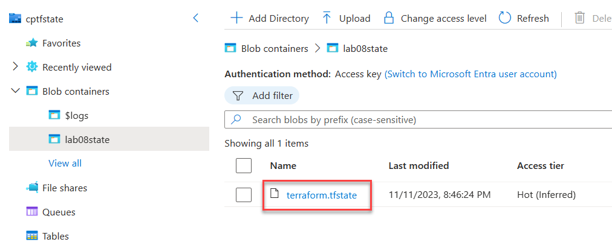

# Lab 08 - State

In this lab, we're going to store Terraform state in a container in Azure. This is a good practice for a number of reasons:
    1. It's a central location for all of your state
    2. Multiple people can access the state
    3. Locking is built in to prevent multiple people from modifying the state at the same time
    4. Protect against inadvertant deletion of state

This is just one of a number of ways to store state. For more information, see [this page](https://www.terraform.io/docs/state/remote.html).

## Create a resource group and storage account for storing state

1. In the Azure portal, create a resource group named `tfstate-rg` in the `East US` region.

2. In the Azure portal, within the `tfstate-rg`create a standard LRS storage account with a unique name.

3. Once deployed, navigate to the storage account and select `Containers` from the left-hand menu. Create a container named `lab08state`.

4. Retrieve the storage account key by selecting **Access keys** from the left-hand menu. Copy the value of **key1** and save it in notepad for later.

## Setup the lab files

1. In Visual Studio Code, create the folder `lab-08-state`.
   
2. In the `lab-08-state` folder, create the file `main.tf`.
   
3. Add the following code to `main.tf` - this configuration will create a resource group and a network security group:

    ```hcl
   terraform {
        required_providers {
            azurerm = {
                source  = "hashicorp/azurerm"
                version = "3.79.0"
            }
        }
    }

    provider "azurerm" {
        # Configuration options
        features {}
    }

    resource "azurerm_resource_group" "labrg" {
        name     = "tflab07-rg"
        location = "East US"
        tags = {
            environment = "dev"
            costcenter  = "it"
        }
    }

    resource "azurerm_network_security_group" "network" {
        name                = "lab07-nsg"
        location            = azurerm_resource_group.labrg.location
        resource_group_name = azurerm_resource_group.labrg.name

        dynamic "security_rule" {
            for_each = {
                rdp = {
                    name      = "rdp-inbound"
                    direction = "Inbound"
                    priority  = 100
                    port      = 3389
                },
                http = {
                    name      = "https-outbound"
                    direction = "Outbound"
                    priority  = 101
                    port      = 443
                }
            }
            content {
                name                       = security_rule.value["name"]
                priority                   = security_rule.value["priority"]
                direction                  = security_rule.value["direction"]
                access                     = "Allow"
                protocol                   = "Tcp"
                source_address_prefix      = "*"
                destination_address_prefix = "*"
                source_port_range          = "*"
                destination_port_range     = security_rule.value["port"]
            }
        }
    }
    ```

## Create the backend configuration to point to the Azure Blob Storage account

1. Modify the `terraform` block to include the definition of the azurerm backend. Replace `<STORAGE_ACCOUNT_NAME>` with the unique name of the storage account you created in the first exercise of this lab.
   
    ```hcl
    terraform {
        required_providers {
            azurerm = {
                source  = "hashicorp/azurerm"
                version = "3.79.0"
            }
        }
        backend "azurerm" {
            resource_group_name  = "tfstate-rg"
            storage_account_name = "<STORAGE_ACCOUNT_NAME>"
            container_name       = "lab08state"
            key                  = "terraform.tfstate"
        }
    }

2. Create an environment variable containing the storage account access key. Replace the value of `<STORAGE_ACCOUNT_KEY_1>` with the value of **key1** from the storage account saved earlier. Execute the following from the Visual Studio Code terminal (if you are using Bash use `export` instead of `set`):
   
    ```PowerShell
    set ARM_ACCESS_KEY=<STORAGE_ACCOUNT_KEY_1>
    ```

3. Execute `terraform init`. You should see a message indicating the backend was initialized successfully.

4. In the Azure Portal, navigate to the lab 8 storage account and open the `lab08state` container. You should see a file named `terraform.tfstate` has been created. Also notice that the local `terraform.tfstate` file has not been created in the local file system.
   
   

5. Select the `terraform.tfstate` file in the Azure Portal to view the file properties. Pay close attention to the Lease State and Lease Status properties. These properties are used to prevent multiple people from modifying the state at the same time. If you attempt to run `terraform apply` while the state is locked, you will receive an error message. Close the blob properties blade.
   
   

6. To view the contents of the `terraform.tfstate` file, right-click the row (not directly on the file name link) and select **View/edit**.

7. Execute `terraform apply` to deploy the resources.

8. Revisit the `terraform.tfstate` file in the Azure Portal. Select to **view/edit** the blob. Notice that the file has been updated with the resources that were deployed. You may close the View/edit blade.

## Experience Terraform state commands

In this exercise, you will experience the `terraform state` commands. These commands are useful for troubleshooting and managing state. Please note that because we are using blob storage for remote state that there will be additional latency. Use patience.

1. In the Visual Studio Code terminal, execute the following to list all resources currently in state for the workspace, you should see both the resource group and the network security group listed:
   
    ```PowerShell
    terraform state list
    ```

2. Execute the following to view the details of the resource group:
   
    ```PowerShell
    terraform state show azurerm_resource_group.labrg
    ```

3. Issue the `terraform destroy` command to delete the resources created in this lab. You will need to delete the remote state resource group and storage account manually as they are not managed by the workspace configuration.

Congratulations, you've completed lab 8!
